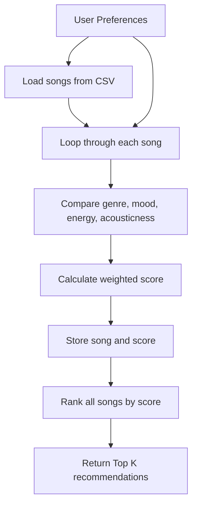
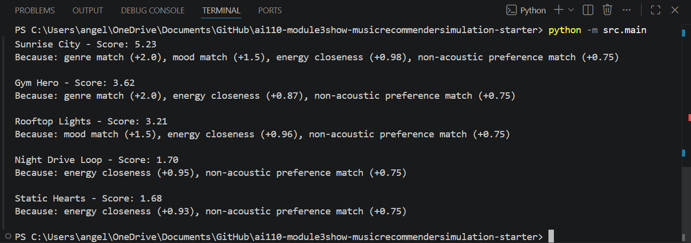
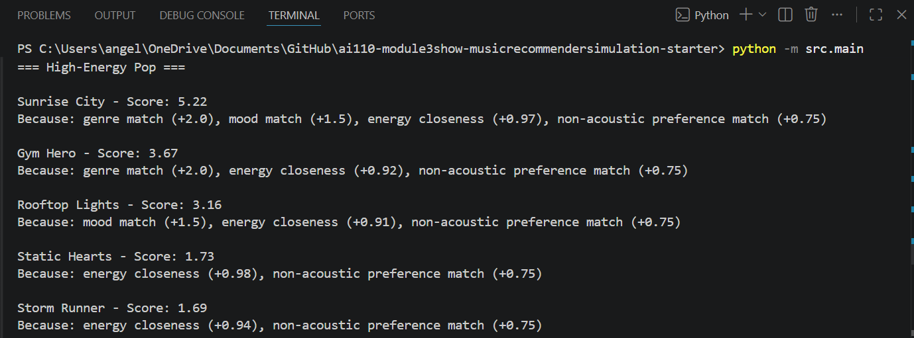
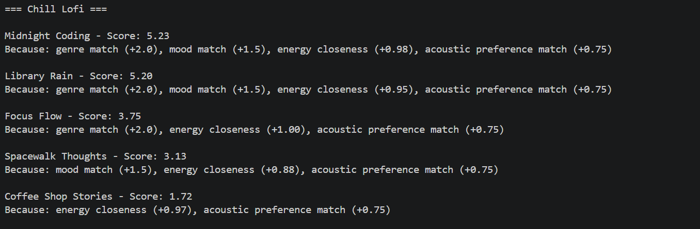
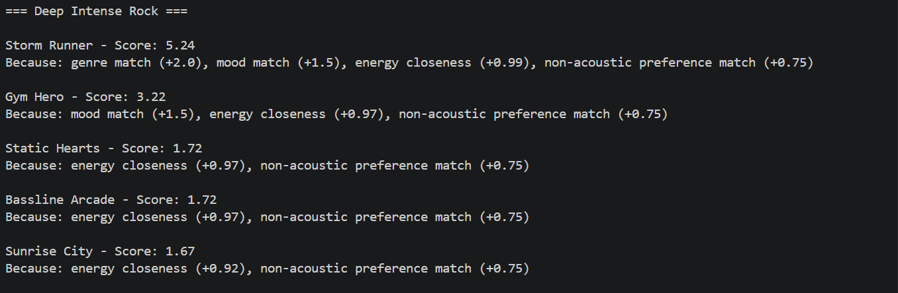
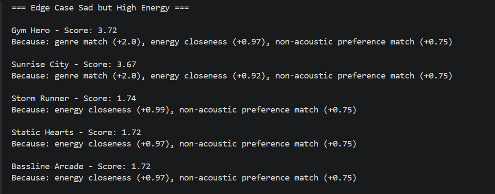
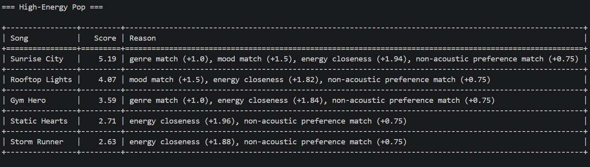
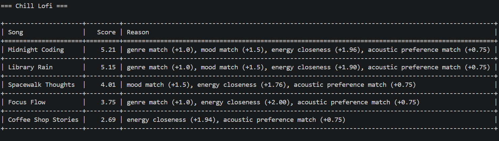
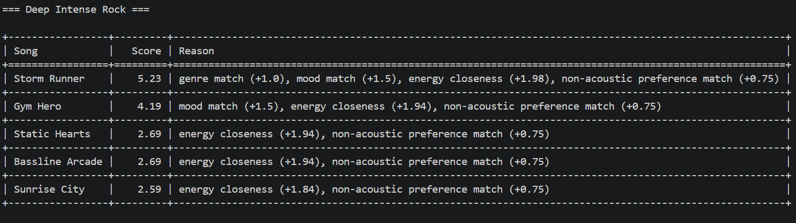
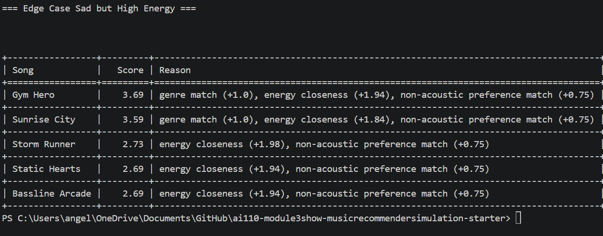

# 🎵 Music Recommender Simulation

## Project Summary

This project simulates a small music recommender system using a content-based filtering approach. The system recommends songs by comparing song attributes such as genre, mood, energy, tempo_bpm, valence, danceability, and acousticness with a user's taste profile. Instead of using behavior from many users, this recommender focuses on the features of each song and calculates how closely they match a user's preferences. The goal of this project is to show how recommendation systems can turn structured song data into personalized suggestions.

---

## How The System Works

This recommender uses a content-based filtering method. Each song is represented by features such as genre, mood, energy, tempo_bpm, valence, danceability, and acousticness. The user profile stores preference information such as favorite genre, favorite mood, target energy, and whether the user likes acoustic songs.

The recommender computes a score for each song by comparing the song's features with the user's preferences. Songs receive strong points when the genre and mood match the user's taste. Numerical features such as energy, tempo, valence, and danceability are scored based on how close they are to the user's preferred values. After all songs are scored, the system ranks them from highest to lowest score and recommends the top results.

This design is inspired by real-world recommendation systems, which often combine content-based filtering with collaborative filtering. However, this project focuses only on song features and user taste data, making the logic easier to understand and explain.

### Features Used

**Song**
- genre
- mood
- energy
- tempo_bpm
- valence
- danceability
- acousticness

**UserProfile**
- favorite_genre
- favorite_mood
- target_energy
- likes_acoustic

### Example User Profile

For this simulation, I use a user profile with the following preferences:

- favorite_genre: lofi
- favorite_mood: chill
- target_energy: 0.4
- likes_acoustic: true

This profile represents a listener who prefers calm, lower-energy music with a more acoustic feel. I chose it because it creates a clear contrast with intense, high-energy songs such as rock or EDM, making it easier to test whether the recommender can distinguish between different musical vibes.

### Algorithm Recipe

My recommender uses a weighted scoring approach for each song.

- +2.0 points if the song's genre matches the user's favorite genre
- +1.5 points if the song's mood matches the user's favorite mood
- Up to +1.0 point based on how close the song's energy is to the user's target energy
- +0.75 points if the song's acousticness matches the user's acoustic preference

After scoring every song in the catalog, the system sorts them from highest to lowest score and returns the top K recommendations.

### Potential Biases

This system may over-prioritize genre and mood, which means it could ignore songs that have a very similar vibe but belong to a different genre. It may also over-favor songs with acousticness values that fit the user's preference threshold, even when other features are strong matches. Because the catalog is small, the recommendations may reflect the limited genres and moods available in the dataset rather than the full range of a real user's taste.

### Recommendation Flow



## Getting Started

### Setup

1. Create a virtual environment (optional but recommended):

   ```bash
   python -m venv .venv
   source .venv/bin/activate      # Mac or Linux
   .venv\Scripts\activate         # Windows

2. Install dependencies

```bash
pip install -r requirements.txt
```

3. Run the app:

```bash
python -m src.main
```

### Running Tests

Run the starter tests with:

```bash
pytest
```

You can add more tests in `tests/test_recommender.py`.

---

## Experiments You Tried

### CLI Output Example

Below is an example of the recommender running in the terminal with the default user profile.



For the default profile, songs like **Sunrise City** and **Gym Hero** ranked highly because they matched the user's preferred genre, mood, and energy level. This showed that the scoring logic was working as expected and that the recommender could explain why each song was selected.

I tested the recommender using multiple user profiles to evaluate how it behaves under different preferences:

- High-Energy Pop
- Chill Lofi
- Deep Intense Rock
- Edge Case (high energy but sad mood)

### High-Energy Pop


### Chill Lofi


### Deep Intense Rock


### Edge Case


### Optional Extension: Visual Summary Table

I improved the CLI output by displaying recommendations in a formatted table using the `tabulate` library. This made it easier to compare songs, scores, and recommendation reasons across different user profiles.

### High-Energy Pop (Table View)


### Chill Lofi (Table View)


### Deep Intense Rock (Table View)


### Edge Case (Table View)


### Observations

For the High-Energy Pop profile, songs like **Sunrise City** ranked highly because they matched both genre and mood while also having strong energy similarity.

For the Chill Lofi profile, songs like **Midnight Coding** and **Library Rain** appeared at the top, which matched expectations because they had low energy and acoustic characteristics.

For the Deep Intense Rock profile, high-energy songs such as **Storm Runner** ranked highest, showing that energy and mood strongly influenced the output.

The Edge Case profile (high energy but sad mood) revealed a limitation. The recommender still returned energetic songs instead of sad ones, showing that the system struggles with conflicting preferences.

### Experiment: Weight Shift

I modified the scoring logic by reducing the genre weight and increasing the importance of energy.

After this change, high-energy songs appeared more frequently across different profiles, even when genre did not match. This showed that energy became the dominant factor in ranking.

This experiment helped demonstrate how changing weights directly affects recommendation behavior and can introduce bias toward certain features.
### Testing

I also ran the automated tests for the recommender using:
python -m pytest

---

## Limitations and Risks

This recommender works on a small catalog and only uses a limited set of song features. It does not consider lyrics, artist familiarity, listening history, or changing user tastes over time. Because the scoring gives strong weight to genre and mood, it may overlook songs from other genres that still match the user's overall vibe. The small dataset may also make the system seem more certain than it really is, since there are fewer alternatives to compare.

---

## Reflection

When comparing the different profiles, I noticed clear differences in how the recommendations changed. The High-Energy Pop profile pushed energetic and upbeat songs to the top, while the Chill Lofi profile favored lower-energy and more acoustic tracks. This shows that the recommender responds well to energy and acoustic preferences.

The Deep Intense Rock profile focused more on intense songs with high energy, which made sense because both genre and energy were strong matches. In contrast, the edge-case profile (high energy but sad mood) revealed a weakness. Even though the user selected a sad mood, the recommender still returned energetic songs.

This helped explain why songs like Gym Hero kept appearing. The system gives strong weight to energy, so songs with high energy tend to rank highly even when other preferences do not fully match. This shows how the scoring logic can create bias and affect the final recommendations.

Read `model_card.md`:

[**Model Card**](model_card.md)

Working on this project helped me understand how recommendation systems turn structured data into predictions. Even a simple recommender can compare song features with a user profile, assign scores, and rank songs in a way that feels personalized.

I also realized how easily bias can appear. Since the system heavily relies on genre and mood, it may repeatedly recommend similar types of songs and ignore others that could still match the user's vibe. This shows how real-world systems can create filter bubbles by limiting diversity.


---